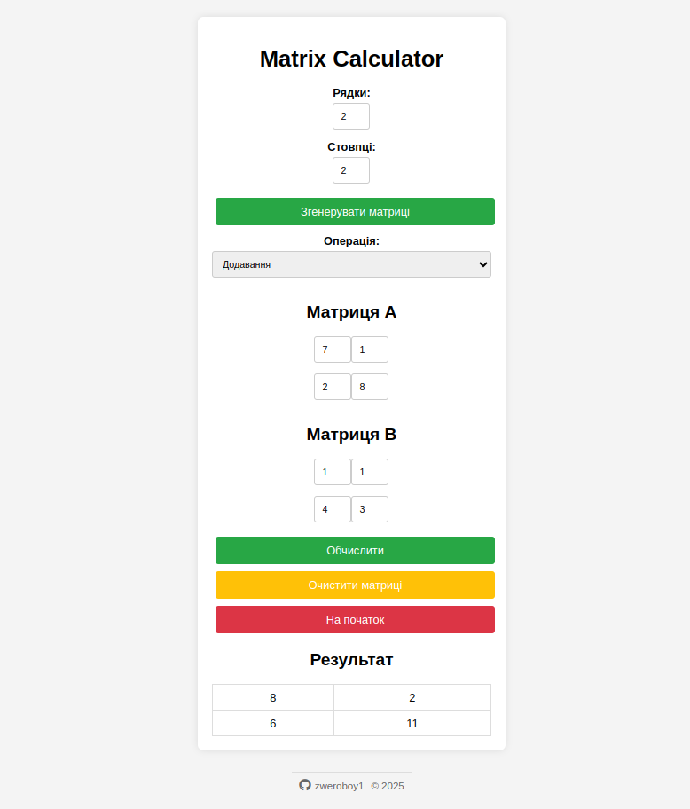

# Калькулятор матриць

Калькулятор матриць — це веб-додаток для виконання операцій над матрицями. Він дозволяє генерувати випадкові матриці, виконувати операції додавання, віднімання, множення та транспонування, а також відображає результат у зручній таблиці.

## Основні функції

- **Генерація випадкових матриць**: Користувач може вказати кількість рядків і стовпців, і додаток згенерує дві матриці.
- **Операції над матрицями**:
  - Додавання (`+`)
  - Віднімання (`-`)
  - Множення (`*`)
  - Транспонування матриці A або B
- **Валідація даних**:
  - Перевірка, що всі комірки матриць заповнені числами.
  - Перевірка розмірів матриць для виконання операцій (наприклад, додавання та віднімання вимагають однакових розмірів, а множення — сумісних розмірів).
- **Обробка помилок**:
  - Користувач отримує детальні повідомлення про помилки українською мовою.
  - Помилки відображаються у стилізованому блоці з іконкою.
- **Зручний інтерфейс**:
  - Кнопка **"Очистити"** для очищення значень у матрицях.
  - Кнопка **"На початок"** для скидання всієї форми до початкового стану.

## Скріншот додатку



## Демо-версія

Спробуйте додаток у дії: [Демо-версія Калькулятора матриць](https://helpseo.net/matrix/)

## Встановлення та запуск

1. Клонуйте репозиторій:

```bash
git clone https://github.com/zweroboy1/php-matrix-calculator.git
cd php-matrix-calculator
```

Переконайтеся, що у вас встановлено PHP (версія 7.4 або вище).

2. Запустіть локальний сервер:

```bash
php -S localhost:8000
```

3. Відкрийте браузер і перейдіть за адресою:

```bash
http://localhost:8000
```

## Технології

- **Frontend**: HTML, CSS, JavaScript
- **Backend**: PHP
- **Інші інструменти**: Fetch API для асинхронних запитів, Font Awesome для іконок.
